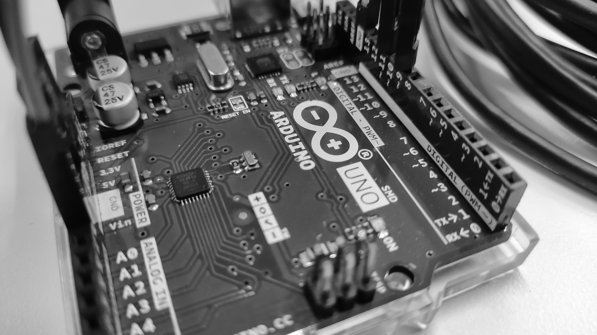

# Physical Computing

HS 2022 Interaction Design ZHdK

Author: Carina Good

Mentors: Luke Franzke & Paulina Zybinska

---

## Inforamtion
Each folder is named after the exercise and contains the code, a picture and the schematics.

